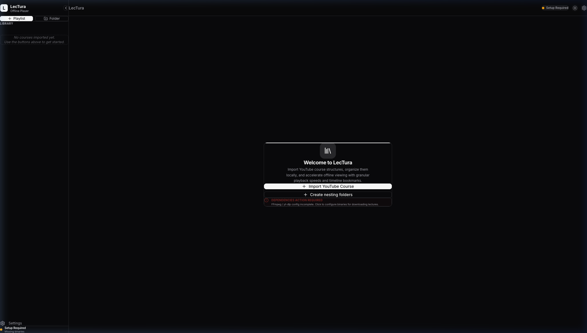

<div align="center">

# 📚 LecTura

### *A Distraction-Free YouTube Lecture Manager & Offline Study Workspace*

[](https://github.com/TheShahnawaaz/LecTura/releases)
[](https://github.com/TheShahnawaaz/LecTura/actions)
[](#)
[](LICENSE)

<br/>

<br/>

*Premium Dark Mode interface of LecTura, optimized for focused, distraction-free study.*

</div>

---

## 🌟 What is LecTura?

**LecTura** is a native desktop application designed for students, developers, and self-learners. It transforms YouTube from a distraction-filled entertainment platform into a clean, local-first interactive lecture hall. Organize your study playlists, download lectures for offline study, and control playback speed seamlessly.

---

## ✨ Key Features

- **⚡ Zero-API Import**: Import entire YouTube playlists or single video URLs instantly—no Google API keys required.
- **📂 Nested Folders**: Keep your courses organized in custom nested directory structures.
- **🌐 Dual-Mode Hybrid Player**: Switch dynamically between online streaming and local HTML5 video playback once downloaded.
- **🚀 Accelerated Playback Speed**: Accelerate learning speeds up to **6.0x** for downloaded lectures (and up to **2.0x** online).
- **🎛️ Unified Keyboard Shortcuts**: Control playback, seek position, toggle volume/mute, and adjust speeds using intuitive shortcuts.
- **🛑 Download Control**: Queue lectures to download in the background using `yt-dlp` sidecars, with granular controls to cancel single or course-wide downloads at any point.
- **🎨 Premium Theme System**: Sleek obsidian dark mode and harmonious light mode designed for extended study sessions.

---

## ⌨️ Playback Keyboard Shortcuts

LecTura supports standard YouTube navigation hotkeys for both local and online video players:

| Hotkey | Action | Target Range |
| :--- | :--- | :--- |
| <kbd>Space</kbd> or <kbd>K</kbd> | Play / Pause | Online & Offline |
| <kbd>S</kbd> | Decrease Playback Speed (-0.1x) | Online: `0.25x` | Offline: `0.1x` |
| <kbd>D</kbd> | Increase Playback Speed (+0.1x) | Online: `2.0x` | Offline: `6.0x` |
| <kbd>Arrow Left</kbd> | Seek Backward (5 seconds) | Online & Offline |
| <kbd>Arrow Right</kbd> | Seek Forward (5 seconds) | Online & Offline |
| <kbd>J</kbd> | Seek Backward (10 seconds) | Online & Offline |
| <kbd>L</kbd> | Seek Forward (10 seconds) | Online & Offline |
| <kbd>Arrow Up</kbd> | Increase Volume | Online & Offline |
| <kbd>Arrow Down</kbd> | Decrease Volume | Online & Offline |
| <kbd>M</kbd> | Mute / Unmute | Online & Offline |
| <kbd>F</kbd> | Toggle Fullscreen (Native Window) | Online & Offline |
| <kbd>0</kbd> - <kbd>9</kbd> | Seek to Percentage (0% to 90%) | Online & Offline |
| <kbd>Escape</kbd> | Exit Fullscreen Mode | Online & Offline |

*Note: Keyboard shortcuts are automatically disabled when typing in input dialogs or text areas to prevent collisions.*

---

## 🛠️ Installation & Setup

### Prerequisites

To compile the application locally, you will need:
- **Node.js** (v20 or newer)
- **Rust** (stable toolchain via rustup)
- **Xcode Command Line Tools** (on macOS: `xcode-select --install`)

### Local Development

1. **Clone the repository**:
   ```bash
   git clone https://github.com/TheShahnawaaz/LecTura.git
   cd LecTura
   ```

2. **Install frontend dependencies**:
   ```bash
   npm install
   ```

3. **Launch the development server**:
   ```bash
   npm run tauri dev
   ```

---

## 📦 Versioning & Release Pipeline

### Single Source of Truth
We use a unified versioning pipeline where `package.json` is the single source of truth. 

To keep everything synchronized across Rust compile manifests and Tauri bundlers, we use an automated version sync script:
- **`tauri.conf.json`** version points dynamically to `package.json` via:
  ```json
  "version": "../package.json"
  ```
- **`Cargo.toml`** version is updated automatically before execution.

#### ⚠️ Synchronization Hook
The [sync-version.js](sync-version.js) script runs automatically whenever you trigger local development or build scripts:
* Running `npm run dev` or `npm run build` will dynamically update the Cargo package version to match `package.json`.
* To run the sync manually:
  ```bash
  node sync-version.js
  ```

### Automated Deployments
To deploy a new update:
1. Bump the `"version"` field in `package.json`.
2. Commit and push your changes to the `main` branch.
3. Push a matching git version tag (e.g. `v0.1.1`):
   ```bash
   git tag v0.1.1
   git push origin v0.1.1
   ```
This automatically triggers the GitHub Actions CI/CD release workflow which compiles and signs the binaries for macOS and Windows, uploading them directly to the GitHub Release page along with a serverless auto-update manifest (`latest.json`).

---

## 📄 License

This project is licensed under the MIT License - see the [LICENSE](LICENSE) file for details.
