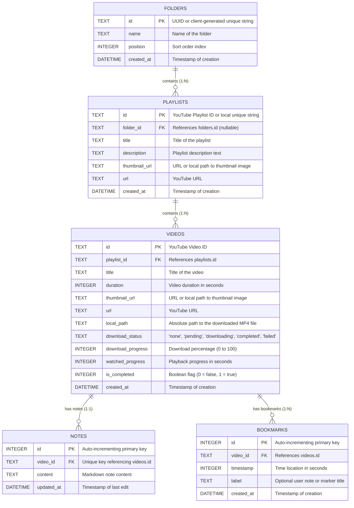

# LecTura: Database Design & Migration Strategy

This document details the database architecture, table schemas, migration strategy, and Rust API design for **LecTura**.

---

## 1. Rationale: Why SQLite over JSON?

While a local `db.json` file is simple to set up initially, it is poorly suited for a rich, offline-capable study tool due to the following reasons:
1. **Atomic and Durable Writes (ACID)**: A crash or sudden shutdown during a JSON write can result in complete data loss (corruption). SQLite uses write-ahead logging (WAL) or rollback journals to ensure writes are fully transaction-safe.
2. **Relational Integrity**: If a user deletes a folder or a playlist, we want to cleanly cascade-delete the corresponding videos, bookmarks, and notes. SQLite handles this natively using `FOREIGN KEY` constraints with `ON DELETE CASCADE`.
3. **Partial Updates**: Rewriting a multi-megabyte JSON file on every progress tick (e.g., updating a video's watched seconds every 5 seconds) is computationally wasteful. SQLite allows quick row-level updates.
4. **Offline Path Management**: Local file paths for downloaded videos are stored alongside online video metadata, making it easy to query and switch player modes.

---

## 2. Entity-Relationship (ER) Diagram

The relationships between LecTura's entities are structured as follows:



---

## 3. Table Schema Definitions

### `folders`
Stores user-created collection groups to organize playlists.
```sql
CREATE TABLE IF NOT EXISTS folders (
    id TEXT PRIMARY KEY,
    name TEXT NOT NULL,
    position INTEGER NOT NULL,
    created_at DATETIME DEFAULT CURRENT_TIMESTAMP
);
```

### `playlists`
Stores playlist metadata imported from YouTube.
```sql
CREATE TABLE IF NOT EXISTS playlists (
    id TEXT PRIMARY KEY,
    folder_id TEXT,
    title TEXT NOT NULL,
    description TEXT,
    thumbnail_url TEXT,
    url TEXT,
    created_at DATETIME DEFAULT CURRENT_TIMESTAMP,
    FOREIGN KEY(folder_id) REFERENCES folders(id) ON DELETE SET NULL
);
```

### `videos`
Stores individual lecture video states, progress, and download information.
```sql
CREATE TABLE IF NOT EXISTS videos (
    id TEXT PRIMARY KEY,
    playlist_id TEXT,
    title TEXT NOT NULL,
    duration INTEGER NOT NULL,
    thumbnail_url TEXT,
    url TEXT NOT NULL,
    local_path TEXT,
    download_status TEXT DEFAULT 'none', -- 'none', 'pending', 'downloading', 'completed', 'failed'
    download_progress INTEGER DEFAULT 0,
    watched_progress INTEGER DEFAULT 0,
    is_completed INTEGER DEFAULT 0, -- 0 for false, 1 for true
    created_at DATETIME DEFAULT CURRENT_TIMESTAMP,
    FOREIGN KEY(playlist_id) REFERENCES playlists(id) ON DELETE CASCADE
);
```

### `notes`
Stores the markdown notes written side-by-side with each video. We enforce a 1-to-1 relationship with the video using a `UNIQUE` constraint on `video_id`.
```sql
CREATE TABLE IF NOT EXISTS notes (
    id INTEGER PRIMARY KEY AUTOINCREMENT,
    video_id TEXT UNIQUE NOT NULL,
    content TEXT NOT NULL,
    updated_at DATETIME DEFAULT CURRENT_TIMESTAMP,
    FOREIGN KEY(video_id) REFERENCES videos(id) ON DELETE CASCADE
);
```

### `bookmarks`
Stores specific timestamp annotations. When a user clicks a bookmark, the player seeks to that timestamp.
```sql
CREATE TABLE IF NOT EXISTS bookmarks (
    id INTEGER PRIMARY KEY AUTOINCREMENT,
    video_id TEXT NOT NULL,
    timestamp INTEGER NOT NULL, -- in seconds
    label TEXT,
    created_at DATETIME DEFAULT CURRENT_TIMESTAMP,
    FOREIGN KEY(video_id) REFERENCES videos(id) ON DELETE CASCADE
);
```

---

## 4. Migration Strategy (`PRAGMA user_version`)

To support evolving schemas without breaking existing local databases, we use SQLite's `user_version` PRAGMA combined with atomic transactions in Rust.

### The Migration Lifecycle
1. On app startup, establish a database connection.
2. Query the current version using `PRAGMA user_version`.
3. Compare the current version to the latest version in the code.
4. Apply necessary migrations inside a transaction.
5. Update `PRAGMA user_version` only after successful commits.

### Implementation Blueprint in Rust
```rust
use rusqlite::{Connection, Result};

const MIGRATIONS: &[&str] = &[
    // Version 1: Initial schema setup
    r#"
    CREATE TABLE IF NOT EXISTS folders (...);
    CREATE TABLE IF NOT EXISTS playlists (...);
    CREATE TABLE IF NOT EXISTS videos (...);
    CREATE TABLE IF NOT EXISTS notes (...);
    CREATE TABLE IF NOT EXISTS bookmarks (...);
    "#,
    // Version 2 (Future expansion):
    // r#"
    // ALTER TABLE videos ADD COLUMN playback_speed REAL DEFAULT 1.0;
    // "#
];

pub fn run_migrations(conn: &mut Connection) -> Result<()> {
    let mut current_version: i32 = conn.query_row("PRAGMA user_version", [], |row| row.get(0))?;
    
    for (i, migration) in MIGRATIONS.iter().enumerate() {
        let migration_version = (i + 1) as i32;
        if current_version < migration_version {
            let tx = conn.transaction()?;
            
            // Execute batch migration SQL
            tx.execute_batch(migration)?;
            
            // Increment the user_version in the SQLite metadata
            tx.pragma_update(None, "user_version", migration_version)?;
            
            tx.commit()?;
            current_version = migration_version;
            println!("Migrated database schema to version {}", migration_version);
        }
    }
    Ok(())
}
```

---

## 5. Rust API Interface (Proposed Command Handlers)

The frontend will interact with the database via these custom Tauri commands (invoked via `@tauri-apps/api/tauri`):

| Command | Arguments | Returns | Description |
| :--- | :--- | :--- | :--- |
| `get_folders` | None | `Vec<Folder>` | Retrieves all folders sorted by `position`. |
| `create_folder` | `id: String, name: String` | `()` | Creates a new folder. |
| `delete_folder` | `id: String` | `()` | Deletes a folder (sets associated playlists' `folder_id` to NULL). |
| `get_playlists` | None | `Vec<Playlist>` | Retrieves all playlists. |
| `get_playlist_videos` | `playlist_id: String` | `Vec<Video>` | Retrieves all videos belonging to a playlist. |
| `update_video_progress` | `video_id: String, seconds: i32, is_completed: bool` | `()` | Persists current playback position and completion state. |
| `save_note` | `video_id: String, content: String` | `()` | Inserts or updates the markdown notebook content for a video. |
| `get_note` | `video_id: String` | `Option<Note>` | Retrieves the note for a video, if it exists. |
| `get_bookmarks` | `video_id: String` | `Vec<Bookmark>` | Retrieves all bookmarks for a video, sorted by timestamp. |
| `add_bookmark` | `video_id: String, timestamp: i32, label: String` | `Bookmark` | Adds a new timestamp seek-point. |
| `delete_bookmark` | `id: i32` | `()` | Deletes a bookmark. |
| `update_download_progress` | `video_id: String, status: String, progress: i32, local_path: Option<String>` | `()` | Updates download progress and local location. |
